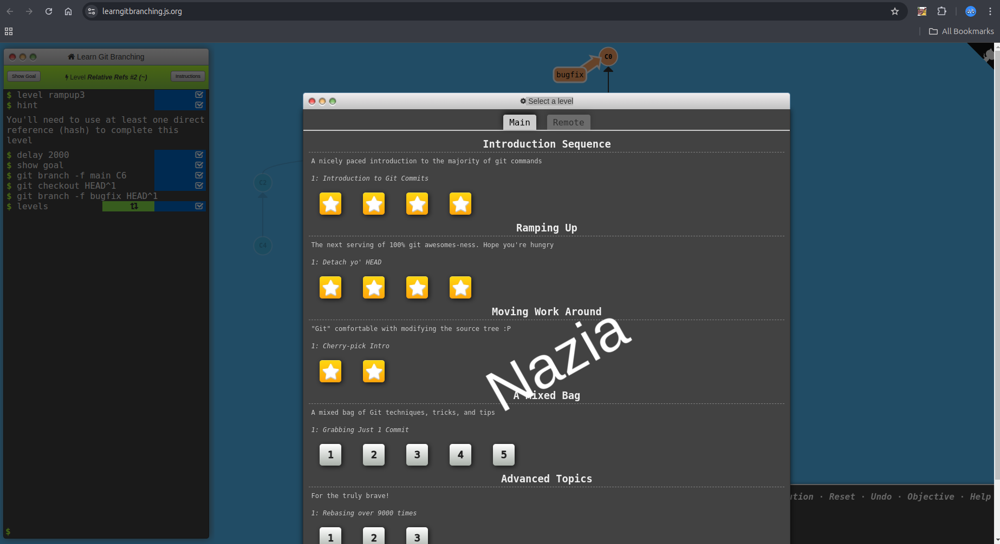
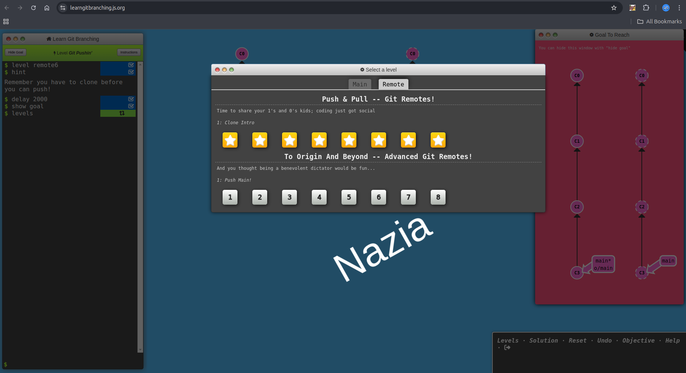

# git-homework2

<!-- Status Badge -->

## Description

This is a repository for CSC 510 homework 2. The repository contains a simple HTML file.

## Image

## Code Example

## Tasks

- [x] Task 1: Complete Git Tutorial
- [x] Task 2: Screenshots added to `README.md`  
- [x] Task 3: Modify `.html` File  
- [x] Task 4: Modify footer in `.html` file  
- [] Task 5: Review pull requests